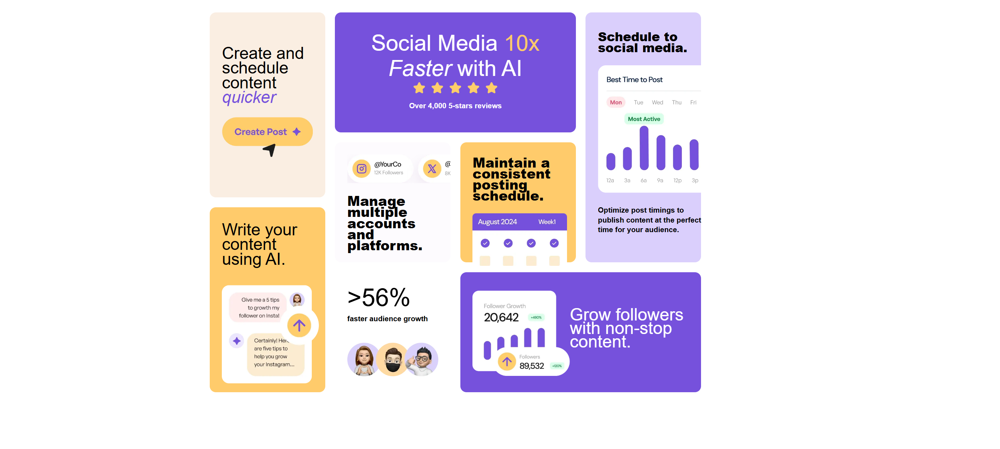

<h1 align="center">Bento grid</h1>

###

  
  
  
  
  

###

📝 Brief Your challenge is to build this bento grid and make it as close to the design as possible.  You can use any tools you like to help you complete the challenge. So, if you have something you'd like to practice, feel free to give it a go.  Your users should be able to:  View the optimal layout for the interface depending on their device's screen size

###

